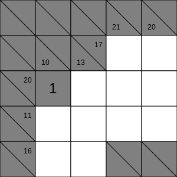
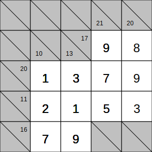

# Kakuro Solver

This project provides a Kakuro puzzle solver and visualizer using the Z3 SMT solver. The solver can read a Kakuro puzzle from a JSON file, solve it, and output the solution in either JSON or SVG format. The visualizer can display the puzzle and its solution in SVG format.

## What is Kakuro?

Kakuro is a logic-based number puzzle that is often referred to as a mathematical crossword. The objective is to fill all of the blank squares in the grid with digits from 1 to 9 such that the sum of the numbers in each horizontal and vertical block matches the clue associated with that block. Additionally, no number may be used more than once in any block. For more information, you can visit [Wikipedia](https://en.wikipedia.org/wiki/Kakuro).

Kakuro puzzles come in all shapes and sizes. This is an example of a simple Kakuro of 5x5:


## What is Z3?

Z3 is a high-performance theorem prover developed by Microsoft Research. It is used for checking the satisfiability of logical formulas over one or more theories. Z3 is widely used in formal verification, program analysis, and other applications that require solving complex logical problems. For more information, you can visit the [Z3 GitHub repository](https://github.com/Z3Prover/z3).

## Features

- Read Kakuro puzzles from JSON files.
- Solve Kakuro puzzles using the Z3 SMT solver.
- Visualize puzzles and solutions in SVG format.

## Requirements

- Python 3.11+
- `z3-solver` library
- `requests` library
- `beautifulsoup4` library
- `jsonschema` library

## Installation

1. Clone the repository:

   ```sh
   git clone https://github.com/anuk909/kakuro-solver.git
   cd kakuro-solver
   ```

2. Create and activate a virtual environment:

   ```sh
   python3.11 -m venv venv
   source venv/bin/activate  # On Windows: venv\Scripts\activate
   ```

3. Install the required dependencies:

   ```sh
   pip install -r requirements.txt
   ```

## Usage

### Command Line Interface

The solver and visualizer can be used via the command line. The following options are available:

- `--input` or `-i`: Path to the input JSON file containing the Kakuro puzzle.
- `--output` or `-o`: Path to the output file where the solution will be saved (output format deduced by suffix).

### Kakuro Solver

To solve a Kakuro puzzle and save the solution as a JSON file:

```sh
python kakuro_solver.py --input examples/puzzle.json
```

If the puzzle is solvable, `examples/puzzle_sol.json` will have the input data + `solution_cells`.

### Kakuro Visualizer

To display a Kakuro puzzle as an SVG file:

```sh
python kakuro_visualizer.py --input examples/puzzle.json
```

**SVG Output:**



To display a Kakuro puzzle and its solution as an SVG file:

```sh
python kakuro_visualizer.py --input examples/puzzle_sol.json
```

**SVG Output:**



### Kakuro Scraper

The Kakuro Scraper is a tool to automatically scrape Kakuro puzzles from the web and save them in JSON format. The scraper fetches puzzles of various sizes and difficulty levels from the [kakuroconquest](https://kakuroconquest.com) website.

The scraper can be used via the command line with the following options:

- --size: Specify the puzzle size to scrape (e.g., 4x4, 6x6, 8x8, 9x11, 9x17).
- --difficulty: Specify the difficulty level to scrape (e.g., easy, intermediate, hard, challenging, expert).
- --count: Number of puzzles to scrape per combination (default is 1).
- --all: Scrape all puzzle combinations.

**Example Commands:**

To Scrape of a single 4x4 easy puzzle:

```sh
python kakuro_scraper.py --size 4x4 --difficulty easy
```

To scrape 5 6x6 hard puzzles:

```sh
python kakuro_scraper.py --size 6x6 --difficulty hard --count 5
```

To scrape all combinations of sizes and difficulties:

```sh
python kakuro_scraper.py --all
```

The scraped puzzles will be saved in the kakuroconquest directory with filenames indicating their size, difficulty, and puzzle ID.

#### JSON Format

The JSON file should adhere to the following structure, as defined by the `PUZZLE_JSON_SCHEMA`:

```
{
  "size": [rows, columns],
  "cells": [
    { "x": row, "y": column, "wall": true },
    { "x": row, "y": column, "right": sum },
    { "x": row, "y": column, "down": sum },
    { "x": row, "y": column, "right": sum, "down": sum }
  ],
  "solution_cells": [
    { "x": row, "y": column, "value": number }
  ]
}
```

- `size`: An array containing exactly two integers representing the number of rows and columns of the puzzle.
- `cells`: An array of cell definitions. Each cell can be:
  - A wall cell: `{ "x": row, "y": column, "wall": true }`
  - A clue cell with a sum to the right: `{ "x": row, "y": column, "right": sum }`
  - A clue cell with a sum downwards: `{ "x": row, "y": column, "down": sum }`
  - A clue cell with sums both to the right and downwards: `{ "x": row, "y": column, "right": sum, "down": sum }`
- `solution_cells`: An array of solution cell values. Each solution cell is defined as:
  - `{ "x": row, "y": column, "value": number }`

Note: The `solution_cells` array is not mandatory in the input JSON file. It is generated by the solver as part of the output.

You can see full file examples in [examples/puzzle.json](examples/puzzle.json), [examples/harder_puzzle.json](examples/harder_puzzle.json), and [examples/puzzle_sol.json](examples/puzzle_sol.json).

For more details, refer to the `PUZZLE_JSON_SCHEMA` in the source code.

## Contact

For any questions or feedback, please contact [anuk909@gmail.com](mailto:anuk909@gmail.com).
