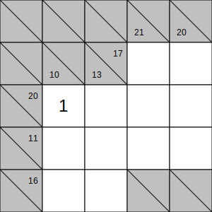

# Kakuro Solver

This project provides a Kakuro puzzle solver and visualizer using the Z3 SMT solver. The solver can read a Kakuro puzzle from a JSON file, solve it, and output the solution in either JSON or SVG format. The visualizer can display the puzzle and its solution in SVG format.

## What is Kakuro?

Kakuro is a logic-based number puzzle that is often referred to as a mathematical crossword. The objective is to fill all of the blank squares in the grid with digits from 1 to 9 such that the sum of the numbers in each horizontal and vertical block matches the clue associated with that block. Additionally, no number may be used more than once in any block. For more information, you can visit [Wikipedia](https://en.wikipedia.org/wiki/Kakuro).

Kakuro puzzles come in all shapes and sizes. This is an example of a simple Kakuro of 5x5:


## What is Z3?

Z3 is a high-performance theorem prover developed by Microsoft Research. It is used for checking the satisfiability of logical formulas over one or more theories. Z3 is widely used in formal verification, program analysis, and other applications that require solving complex logical problems. For more information, you can visit the [Z3 GitHub repository](https://github.com/Z3Prover/z3).

## Features

- Read Kakuro puzzles from JSON files.
- Solve Kakuro puzzles using the Z3 SMT solver.
- Visualize puzzles and solutions in SVG format.

## Requirements

- Python 3.11+
- `z3-solver` library

## Installation

1. Clone the repository:

   ```sh
   git clone https://github.com/anuk909/kakuro-solver.git
   cd kakuro-solver
   ```

2. Create and activate a virtual environment:

   ```sh
   python3.11 -m venv venv
   source venv/bin/activate  # On Windows: venv\Scripts\activate
   ```

3. Install the required dependencies:

   ```sh
   pip install -r requirements.txt
   ```

## Usage

### Command Line Interface

The solver and visualizer can be used via the command line. The following options are available:

- `--input` or `-i`: Path to the input JSON file containing the Kakuro puzzle.
- `--output` or `-o`: Path to the output file where the solution will be saved (output format deduced by suffix).

### Solver

To solve a Kakuro puzzle and save the solution as an SVG file:

```sh
python kakuro_solver.py --input examples/puzzle.json
```

**SVG Output:**


To solve a Kakuro puzzle and save the solution as a JSON file:

```sh
python kakuro_solver.py --input examples/puzzle.json
```

### Visualizer

To display a Kakuro puzzle as an SVG file:

```sh
python kakuro_visualizer.py --input examples/puzzle.json
```

**SVG Output:**



To display a Kakuro puzzle and its solution as an SVG file:

```sh
python kakuro_visualizer.py --input examples/puzzle_sol.json
```

**SVG Output:**


#### JSON Format

The input JSON file should have the following structure:

```
{
  "size": [number_of_rows, number_of_columns],
  "cells": [
    { "x": row, "y": column, "wall": true },
    { "x": row, "y": column, "right": sum },
    { "x": row, "y": column, "down": sum },
    { "x": row, "y": column, "right", "down": sum },
  ]
}
```

The output JSON file should have the following structure:

```
{
  "size": [number_of_rows, number_of_columns],
  "cells": [
    { "x": row, "y": column, "wall": true },
    { "x": row, "y": column, "right": sum },
    { "x": row, "y": column, "down": sum },
    { "x": row, "y": column, "right", "down": sum },
  ],
  solution_cells: [
    {"x": row, "y": column, "value": true}
  ]
}
```

- `size`: A list containing the number of rows and columns of the puzzle.
- `cells`: A list of cell definitions. Each cell can be a wall or a clue cell with a sum.
- `solution_cells`: A list of all the solution cells values.

You can see full files examples in [examples/puzzle.json](examples/puzzle.json), [examples/harder_puzzle.json](examples/harder_puzzle.json) and [examples/puzzle_sol.json](examples/puzzle_sol.json).

## Contact

For any questions or feedback, please contact [anuk909@gmail.com](mailto:anuk909@gmail.com).

## Future Plans

- Write a Medium post about the program to share insights and implementation details.
- Develop an OCR module to generate JSON input files from images of Kakuro puzzles.
- Write solvers for many more kinds of puzzles.
